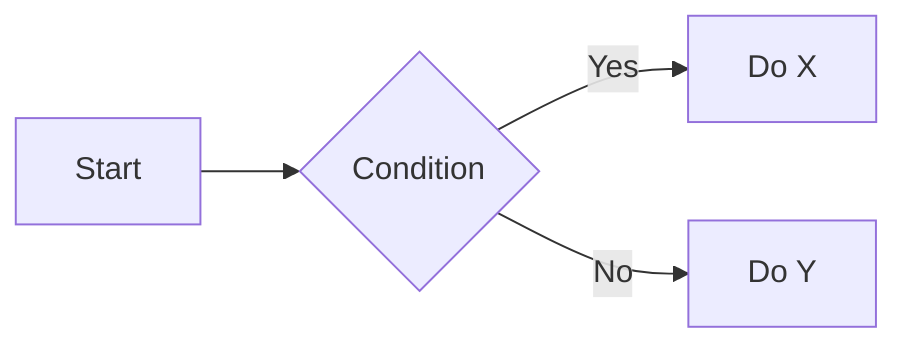

# Project X — Sprint Planning Meeting
**Date:** 2025-12-15
**Time:** 10:00 — 11:30 AM
**Location:** Conference Room B / Zoom

---

## Attendees
- Alice Johnson (PM)
- Bob Lee (Backend)
- Carina Müller (Frontend)
- Daniel Kim (QA)
- Emma Rossi (Design)

## Agenda
1. Review last sprint's outcomes
2. Finalize scope for next sprint
3. Identify blockers & risks
4. Assign action items and owners
5. Confirm release checklist

---

## Summary / Decisions
- We will prioritize the new authentication flow (Epic: `AUTH-42`) and move the A/B testing work to the following sprint.
- Minimum viable scope for next sprint:
  - Implement OAuth2 login
  - Basic account settings screen (read-only)
  - Analytics event for login success/failure

> Decision rationale: authenticating users is a prerequisite for several downstream features and reduces manual QA overhead.

---

## Discussion Notes

### 1) Authentication
- Backend (Bob):
  - Will provide an OAuth2 token endpoint and refresh-token flow.
  - Estimated effort: ~5 dev-days.
- Frontend (Carina):
  - Implement client-side login screen + token storage (secure).
  - Will reuse `auth-storage` utility and update to handle refresh flow.

### 2) Account Settings
- Design (Emma): shared a mock — see link below.
- QA (Daniel): will add regression tests to verify account data is read-only in MVP.

### 3) Telemetry
- Add an analytics event:
  - `login_attempt` (properties: `method`, `success`, `response_time_ms`)
- Bob to add server-side logging for failed attempts (rate-limited).

---

## Action Items (ordered)
1. Bob: Implement OAuth2 token endpoint and document API by **2025-12-19**.
2. Carina: Build the login screen and integrate with token endpoint by **2025-12-22**.
3. Emma: Finalize account settings mockups and supply assets by **2025-12-17**.
4. Daniel: Create automation for login/regression tests and add smoke test to CI by **2025-12-23**.
5. Alice: Coordinate release window and communicate scope to stakeholders by **2025-12-18**.

---

## Blockers & Risks
- Backend capacity: two backend engineers are partially allocated to infra until 2025-12-18. (Risk: delayed OAuth delivery)
- Security review: credential storage approach must pass security review before release.
- External dependency: the identity provider may change certificate rotation schedule.

---

# Links
- [Design mockups](https://www.google.com)

---

# Embedded YouTube Video

<iframe width="560" height="315" src="https://www.youtube.com/embed/dQw4w9WgXcQ" title="YouTube video player" frameborder="0" allow="accelerometer; autoplay; clipboard-write; encrypted-media; gyroscope; picture-in-picture" allowfullscreen></iframe>

---

# Task List
- [x] Setup project repository
- [x] Configure CI/CD pipeline
- [ ] Develop authentication module
- [ ] Create user documentation
- [ ] Conduct security audit

---

# Version History
| Version | Date       | Author            | Description                     |
|---------|------------|-------------------|---------------------------------|
| 1.0     | 2025-12-15 | Alice Johnson      | Initial draft                   |
| 1.1     | 2025-12-16 | Bob Lee            | Added API endpoints              |
| 1.2     | 2025-12-17 | Carina Müller      | Updated design mockups          |
| 1.3     | 2025-12-18 | Daniel Kim         | Fixed typos and formatting      |
| 1.4     | 2025-12-19 | Emma Rossi         | Added release checklist          |

---

# Feedback
For any feedback or questions, please reach out to Alice Johnson at alice.johnson@email.com.

---

# End of Notes

<!--
  Markdown Feature Examples
  This section demonstrates many CommonMark + GFM features and common extensions.
  NOTE: Some examples require renderer support (mermaid, math, admonitions, footnotes,
  definition lists). See the "Supported Renderers / Notes" section below.
-->

## Markdown Feature Examples

### Supported Renderers / Notes
- GitHub-native: headings, emphasis, lists, task lists, tables, fenced code blocks, autolinks, emojis, mentions, details/summary, images, inline HTML (sanitized).
- Extensions (may require plugin): footnotes, definition lists, mermaid, math (KaTeX/MathJax), admonitions, automatic ToC.
- Safety: Raw HTML is sanitized on GitHub (scripts removed); iframes are often stripped. External images leak requester IPs.

---

## Table of Contents
- [Headings](#headings)
- [Paragraphs](#paragraphs)
- [Line Breaks](#line-breaks)
- [Emphasis](#emphasis)
- [Strikethrough](#strikethrough)
- [Horizontal Rules](#horizontal-rules)
- [Blockquotes](#blockquotes)
- [Unordered Lists](#unordered-lists)
- [Ordered Lists](#ordered-lists)
- [Task Lists](#task-lists)
- [Definition Lists](#definition-lists)
- [Tables](#tables)
- [Inline Code](#inline-code)
- [Fenced Code Blocks](#fenced-code-blocks)
- [Indented Code](#indented-code)
- [Autolinks](#autolinks)
- [Links](#links)
- [Images](#images)
- [Emojis](#emojis)
- [Mentions & Issue Links](#mentions--issue-links)
- [Footnotes](#footnotes)
- [Anchors & ToC](#anchors--toc)
- [Collapsible Sections](#collapsible-sections)
- [Inline HTML](#inline-html)
- [Mermaid Diagrams](#mermaid-diagrams)
- [Math (LaTeX)](#math-latex)
- [Admonitions / Callouts](#admonitions--callouts)
- [Keyboard Shortcuts](#keyboard-shortcuts)
- [Front Matter](#front-matter)
- [Escaping](#escaping)
- [References & Long Docs](#references--long-docs)
- [Safety Notes](#safety-notes)

---

## Headings
# Heading 1
## Heading 2
### Heading 3
#### Heading 4
##### Heading 5
###### Heading 6

A short line under headings to show spacing.

## Paragraphs
This is the first paragraph. It contains multiple sentences to show normal paragraph flow.

This is the second paragraph separated by a blank line.

## Line Breaks
This is a soft wrap that will flow naturally when rendered across lines.
This is the second visual line of the same paragraph (soft wrap).

This line ends with two spaces to force a hard break.  
Next line starts after a hard break.

Or insert an explicit HTML break:<br>
This appears after an HTML <br> tag.

## Emphasis
*Italic text using asterisks* and _italic using underscores_.

**Bold text** and __bold using underscores__.

***Bold + italic*** combined.

## Strikethrough
This feature marks ~~deprecated~~ text using double tildes.

## Horizontal Rules
A horizontal rule follows:

---

Another style:

***

## Blockquotes
> This is a blockquote. It can contain multiple lines and other elements.
>
> > Nested quote: you can nest blockquotes by adding another >.

## Unordered Lists
- Item A
- Item B
  - Nested B.1
  - Nested B.2
- Item C

Also valid with * or +:
* Asterisk item
+ Plus item

## Ordered Lists
1. First item
2. Second item
   1. Sub-item 2.1
   2. Sub-item 2.2
3. Third item

You can start numbering anywhere; renderers will usually renumber automatically.

## Task Lists
- [x] Completed task
- [ ] Open task
- [ ] Another task

(Checkboxes are interactive on GitHub when displayed in issues/PRs.)

## Definition Lists
Term 1
: Definition for term 1. This is Markdown-Extra / extension-style and may not render on GitHub.

Term 2
: Definition for term 2.

## Tables
| Left aligned | Centered | Right aligned |
| :--- | :---: | ---: |
| foo | bar | 123 |
| long text wraps | centered value | 456 |

## Inline Code
Use `git status` to inspect your working tree. Inline code uses single backticks.

Include language hint for syntax highlighting when available.

## Indented Code
    # Old-style indented code block (4 spaces)
    def hello():
        print("indented hello")

## Autolinks
Plain URLs autolink in many renderers: https://example.com

Email autolink: <user@example.com>

## Links
Inline link: [Example website](https://example.com)

Reference link: [Ref][ref-ex]

[ref-ex]: https://example.com "Example Title"

## Images
Inline image:


Reference-style image:

![Logo][logo]

[logo]: https://via.placeholder.com/120 "Placeholder Logo"

(Warning: external images may leak requester IPs to external hosts.)

## Emojis
Shortcodes render on GitHub: :smile: :tada: :rocket:

## Mentions & Issue Links
Mention a GitHub user: @octocat (renders as a mention on GitHub)
Reference an issue: #123 (links to issue on GitHub when in a repo context)

## Footnotes
Here is a sentence with a footnote.[^1]

[^1]: This is the footnote text. Footnotes require renderer support (e.g., kramdown).

## Anchors & ToC
You can link to this section: [Jump to Headings](#headings)

Many static site generators auto-create anchors for headings.

## Collapsible Sections
<details>
  <summary>Click to expand</summary>

  Hidden content goes here. You can include lists, code, or images.

  ```text
  Example inside a collapsible block
  ```

</details>

## Inline HTML
You can include some HTML. Scripts are typically sanitized/removed.

<div style="border:1px solid #ddd;padding:8px;">A small HTML block inside Markdown.</div>

Iframes are commonly stripped on GitHub; include them with caution:

<iframe src="https://example.com" width="320" height="180" title="example iframe"></iframe>

## Mermaid Diagrams

(Requires a mermaid-enabled renderer.)

## Math (LaTeX)
Inline math: Euler's identity: $e^{i\pi} + 1 = 0$

Display math:
$$
\int_0^1 x^2 \, dx = \frac{1}{3}
$$
(Requires KaTeX/MathJax support.)

## Admonitions / Callouts
::: tip
Remember to save your work frequently.
:::
(Admonition syntax depends on renderer/plugins.)

## Keyboard Shortcuts
Press <kbd>Ctrl</kbd> + <kbd>C</kbd> to copy. Fallback: `Ctrl+C`.


## Front Matter
---
title: "Sample Note with Markdown Features"
author: "Team"
---
(Front matter is used by static site generators like Jekyll/MkDocs.)

## Escaping
Escape special characters: use a backslash to show literal asterisks: \*not italic\*.

## References & Long Docs
Use reference links for readability in long documents. Example: See [API][api-ref].

[api-ref]: https://api.example.com/docs

## Safety Notes
- External images and iframes may leak request metadata and are often sanitized.
- Scripts and unknown HTML elements are removed on many platforms (e.g., GitHub).
- Use trusted sources for embeds and avoid exposing secrets in public docs.

---

<!-- End of Markdown Feature Examples -->
